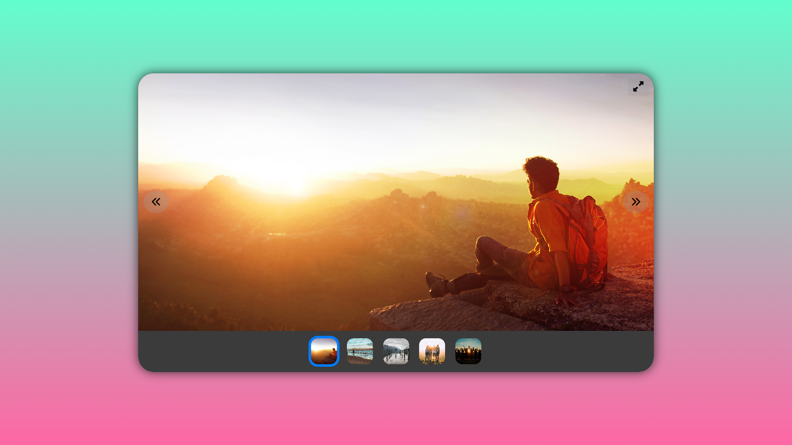

# Modern Image Gallery

A responsive and interactive image gallery built with HTML, CSS, and JavaScript. This gallery features smooth transitions, animations, and a user-friendly interface.

## Features

- 🖼️ Responsive design that works on desktop and mobile devices
- 🔄 Smooth transitions between images
- 👆 Touch-friendly navigation for mobile users
- 🖱️ Click or swipe to navigate through images
- 👍 Thumbnail navigation for quick image selection
- 🔍 Fullscreen mode for immersive viewing
- 🎨 Customizable animations for image transitions

## Demo

Click [here](https://hi-aman-jain.github.io/Modern-Gallery/) to see live demo 🤟

## Installation

1. Clone the repository:
git clone https://github.com/Hi-Aman-Jain/Modern-Gallery.git

2. Navigate to the project directory:
cd modern-image-gallery

3. Open `index.html` in your preferred web browser.

## Usage

- Click on the arrow buttons or swipe to navigate between images
- Click on thumbnails to jump to a specific image
- Use the fullscreen button to enter fullscreen mode
- Press the left and right arrow keys on your keyboard for navigation

## Customization

You can easily customize the gallery by:

- Replacing the images in the `images` folder with your own
- Adjusting the CSS variables in `styles.css` to change colors and sizes
- Modifying the animations in the JavaScript file

## Contributing

Contributions are welcome! Please feel free to submit a Pull Request.

## License

This project is open source and available under the [MIT License](LICENSE).

## Screenshot

